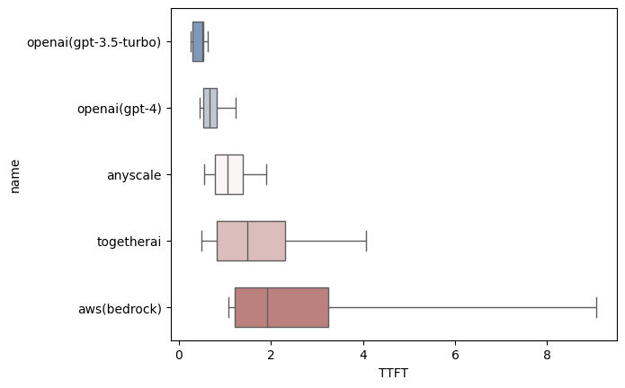
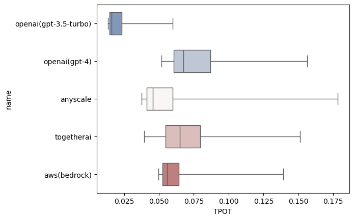

# LLM Endpoint Performance Leaderboard

> Last update: 2024-02-09-06-18-31

## Key metrics

### Time To First Token (TTFT)

This metric represents the time for LLM to return the first token. This metric can influence the performance of some LLM applications with lots of user interactions, for example, chatbots.

> TTFT = time of the first token - time of the request sent out

### Time Per Output Token(TPOT)

This metric represents the speed of the endpoint to inference. For chatting applications, this metric will influence the user experience if this speed is slower than people's reading speed. For LLM-based applications, like knowledge databases or copilot, this metric will influence the end-to-end latency of their application. For example, if we choose the endpoint with a lower TPOT, the knowledge database may react to users' questions faster.

> TPOT = request_time_usage / output_token_num

### Total TPS

This metric represents the capacity of the endpoint to parallel requests. For chatting applications, the endpoint with a higher total TPS will allow the application to chat with more people at the same time. For LLM-based applications, this metric may be helpful to lower the end-to-end latency if some LLM-based operations can be processed parallel.

> Total TPS = sum(tps_per_requests)

## Run Configurations

You can change the config in the `auto-testing.py` to modify the workload and some args.

```python
{'dataset_name': 'synthesizer', 'random_seed': 1234, 'dataset_config': {'func': 'lambda t: int(t / 0.1 + 1) if t < 120 else None', 'prompt_source': 'arena'}, 'workload_range': [None, None], 'kwargs': {'temperature': 0.7, 'top_p': 1, 'max_tokens': 1024, 'skip_idle_min': 20, 'time_step': 0.001, 'request_timeout': 3600}}
```

In our testing config, we send 10 requests to the endpoints for one second and we will keep sending requests for 2 minutes.

## Time To First Token (seconds)

The time for the LLM application to get the first response from the endpoint.



| Name | Mean | Min | Max | Median | p25 | p75 | p5 | p95 |
|:----:|:----:|:---:|:---:|:------:|:---:|:---:|:--:|:---:|
| openai(gpt-3.5-turbo) | 0.47 | 0.239 | 4.564 | 0.524 | 0.296 | 0.545 | 0.259 | 0.834 |
| openai(gpt-4) | 0.691 | 0.4 | 2.701 | 0.627 | 0.531 | 0.784 | 0.462 | 1.136 |
| anyscale | 1.015 | 0.361 | 5.63 | 0.978 | 0.672 | 1.212 | 0.481 | 1.657 |
| togetherai | 1.457 | 0.325 | 7.996 | 1.355 | 0.77 | 1.794 | 0.448 | 2.924 |
| aws(bedrock) | 4.714 | 0.634 | 20.53 | 3.556 | 1.529 | 5.794 | 1.108 | 13.879 |

## Time Per Output Token (ms)

The average time for the endpoint to output one token in a requests



| Name | Mean | Min | Max | Median | p25 | p75 | p5 | p95 |
|:----:|:----:|:---:|:---:|:------:|:---:|:---:|:--:|:---:|
| openai(gpt-3.5-turbo) | 0.025 | 0.013 | 0.552 | 0.016 | 0.015 | 0.023 | 0.014 | 0.055 |
| openai(gpt-4) | 0.084 | 0.048 | 1.351 | 0.067 | 0.061 | 0.08 | 0.054 | 0.144 |
| anyscale | 0.064 | 0.028 | 0.693 | 0.048 | 0.042 | 0.062 | 0.037 | 0.129 |
| togetherai | 0.074 | 0.029 | 0.998 | 0.062 | 0.053 | 0.073 | 0.041 | 0.126 |
| aws(bedrock) | 0.124 | 0.0 | 14.28 | 0.069 | 0.062 | 0.084 | 0.057 | 0.205 |

## Total TPS (Tokens per seconds)

The sum of all ongoing requests' TPS. In this part, we measure the peak TPS in the testing.

| Name | Max |
|:----:|:---:|
| openai(gpt-3.5-turbo) | 2902.0 |
| openai(gpt-4) | 1352.6 |
| anyscale | 806.2 |
| togetherai | 4079.4 |
| aws(bedrock) | 2559.6 |

## Feedback

* please use the issue to report any bugs or suggestions.